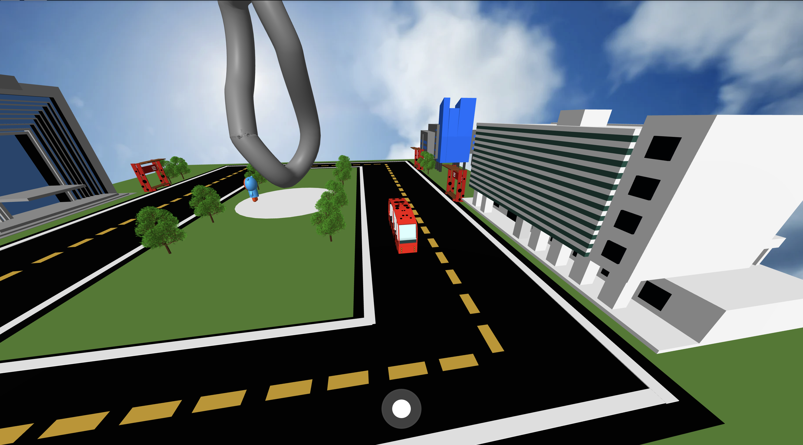
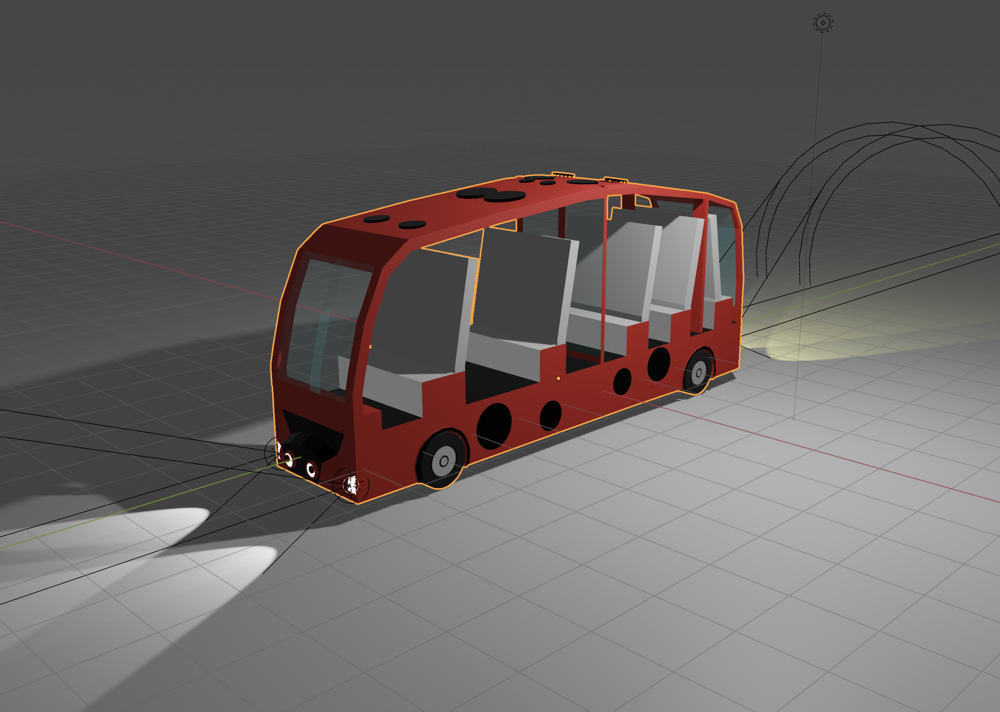
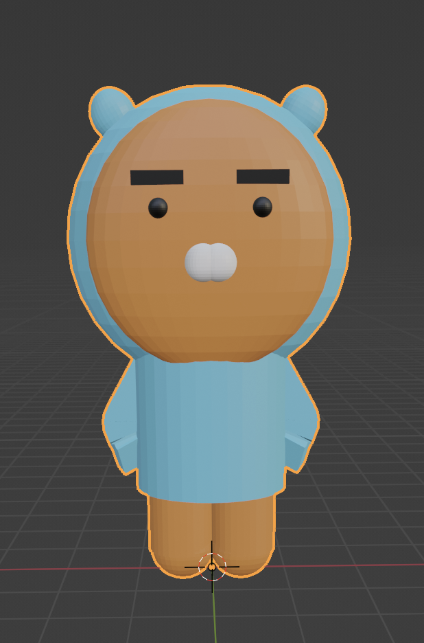
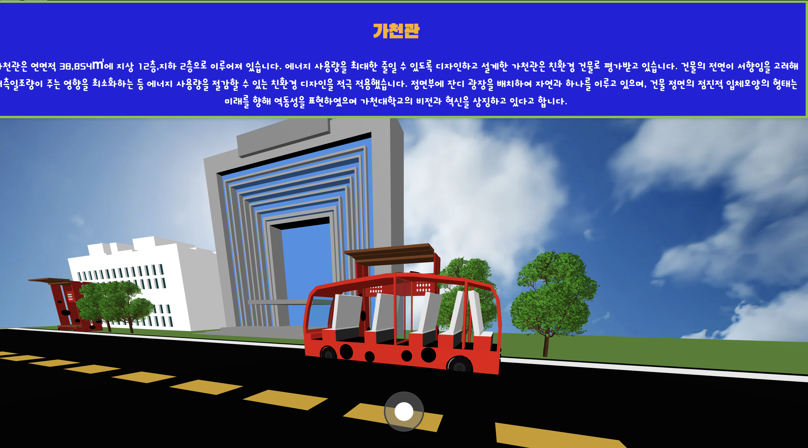
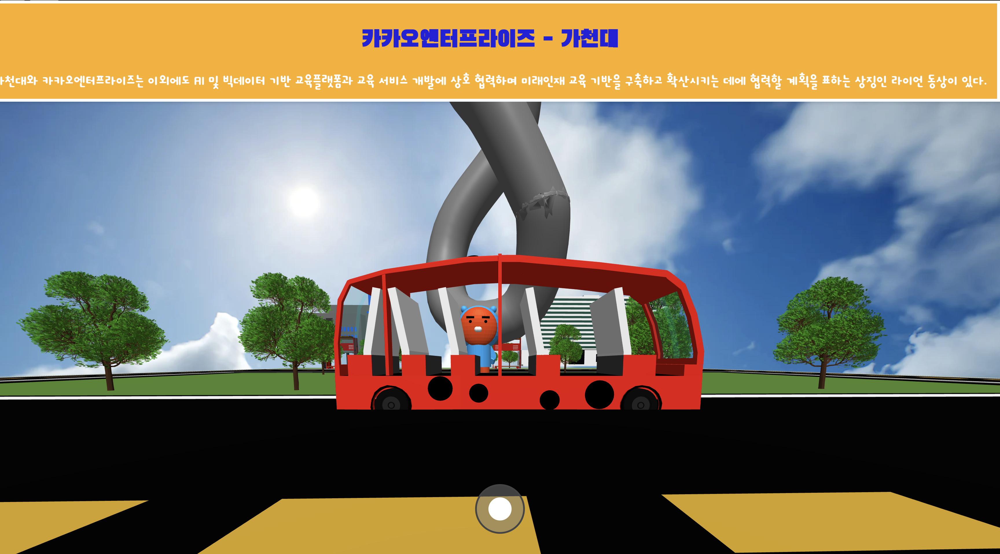

# Computer-Graphics: Mudang Tour 
**Welcome to Mudang-Tour Repository!**  
CG - TermProject Team F  

## Our project aims to **assist** students unfamiliar with school buildings.  

Have you ever been **confused** because you couldn't find a building?  
How about using our Project to see it in advance?  
  

## Functionality 

**Realistic modelling**  
  
  
As you can see above images, our 3D model is very obvious to notices what it is.  
(By Blender)  

**Information center**  
  
     
We show each building/statue's information that user can notice about it.  

